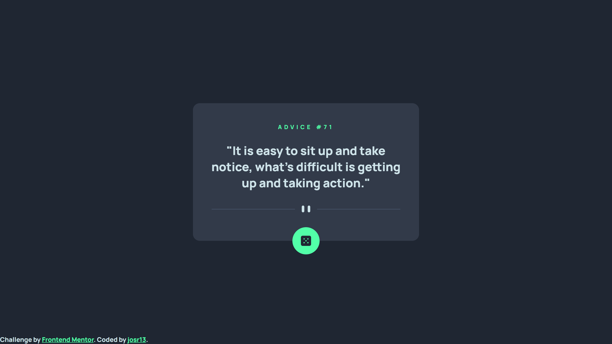

# Advice generator app

This is my solution to the [Advice generator app challenge on Frontend Mentor](https://www.frontendmentor.io/challenges/advice-generator-app-QdUG-13db). Frontend Mentor challenges help you improve your coding skills by building realistic projects. 

## Table of contents

- [Overview](#overview)
  - [Screenshot](#screenshot)
  - [Links](#links)
- [My process](#my-process)
  - [Built with](#built-with)
- [Author](#author)

## Overview

### Screenshot

### Links

- Solution URL: [Frontend Mentor]()
- Live Site URL: [GitHub Pages]()

## My process

### Built with

- Semantic HTML5 markup
- [Sass](https://sass-lang.com/) - CSS preprocessor
- Flexbox
- Sass variables
- Sass partial files
- JavaScript
- Mobile-first workflow
- BEM methodology

## Author

- Website - [Joseph](https://josr13.github.io)
- Frontend Mentor - [@josr13](https://www.frontendmentor.io/profile/josr13)